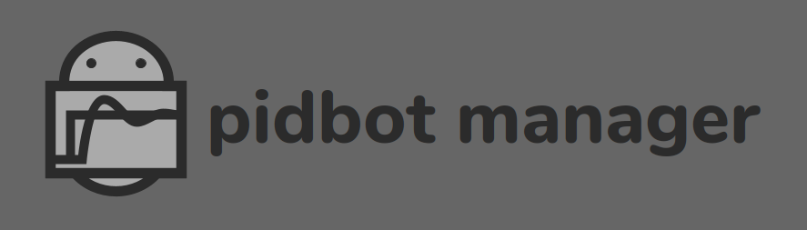
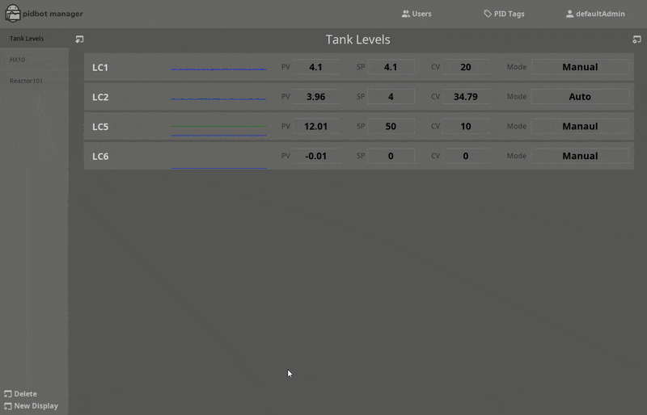

   
  Industrial PID Controller Management - tuning, logging, monitoring and configuration.

  

# Features
* Easy PID import. Browse PLCs for PID tags, and drag them in.
* Compatible with most PLC based PID controllers.
* Simple, **effective** tuning procedure.
* Single interface for all PID types.
* Logs every tuning session.
* Built-in historian.
* PID variable and configuration charts help you troubleshoot and optimize.
* Easy access to PID data via external DB.
* Visualize and organize PIDs with drag and drop ease.
* User management, role based restrictions.
 
# Using Pidbot Manager
Head to the [Pidbot Manager Wiki](../../wiki) for user instructions.

# Quick Setup with Docker
### Requirements
* Docker
* Docker Compose

### Instructions
* Clone or [download](../../archive/master.zip) this repository.
* Open a terminal in the [/docker/latest](./docker/latest) folder (locally), and run `docker-compose up`.
* Open the Ignition Gateway webpage - `http://localhost:8089`, and [login](#user-sources-usernames--passwords).
* Follow instructions in the [OPC Setup](#OPC-Setup) section to connect to your PLC.
* Download the Vision Client launcher from the Gateway Webpage's home page, and install. Manually add the Gateway if necessary `http://localhost:8089`.
* Launch the Pidbot Manager project, and [login](#user-sources-usernames--passwords).

# Manual Setup
### Requirements  
* Ignition v8.0.16
* [Pidbot](https://www.jlbcontrols.com/pidbot) v1.10.2
* MariaDB v10.5

### Option 1: Restore a Gateway Backup
* Download the .gwbk file - Navigate to [releases](../../releases), click assets, then click on the .gwbk file.
* Restore the .gwbk following Ignition's [gateway restore instructions](https://docs.inductiveautomation.com/display/DOC80/Gateway+Backup+and+Restore).
* Follow the instructions in the [Database Setup](#Database-Setup), [Modules Setup](#Modules-Setup), and [OPC Setup](#OPC-Setup) sections below to complete the setup.

### Option 2: Add the project to an existing Ignition Gateway.
* Using the Ignition Gateway webpage, create a user source called `PidbotUserSource`. Create three roles in the user source: `Administrator`,`Engineer`, and `Tuner`.
* Create a user that has the `Administrator` role so you can login to a Client with full privelages.
* Download release files - Navigate to [releases](../../releases), click assets, then click on the project.zip file, types.json file, and tag-groups.json file.
* Restore the project.zip file following Ignition's [project import instructions](https://docs.inductiveautomation.com/display/DOC80/Project+Export+and+Import).
* Using the Ignition Designer, import the types.json file into the `Data Types` tag folder.
* Using the Ignition Designer, import the tag-groups.json file into tag groups.
* Follow the instructions in the [Database Setup](#Database-Setup), [Modules Setup](#Modules-Setup), and [OPC Setup](#OPC-Setup) sections below to complete the setup.

### Database Setup
* Create a database. On the Ignition Gateway webpage, under Config >> Databases >> Connections, create (or edit) a database connection called `pidtuningdb`. Change the configuration of this connection as necessary to connect with your database.
* This project has been tested with MariaDB v10.5 and MySQL v8.0.17. Other database types may be possible, but could require updates to Named Queries to function properly.

### Modules Setup
Two Third-Party modules are used in this project. The Pidbot module is essential, and responsible for PID tuning. The Vision Client OPC Browser module is used to find PID tags in connected PLCs, and create UDT instance tags for them.
* [Download Pidbot](https://www.jlbcontrols.com/pidbot) module v1.10.2 or greater from JLB Controls.
* [Download Vision Client OPC Browser](https://github.com/jlbcontrols/vision-client-opc-browser) module from the releases section of the Github repository.
* Install the .modl files following Ignition's [module installation instructions](https://docs.inductiveautomation.com/display/DOC80/Installing+or+Upgrading+a+Module).

### OPC Setup
* Setup OPC server connections, and PLC connections to access your PID controllers. The easiest way is to use Ignition's built-in OPC-UA Server, and create a device connection using the Ignition Gateway webpage, under OPC UA >> Device Connections.
* If you used Docker or restored a Gateway Backup, there will be a device called `plc1` configured already. You can edit the connectivity settings to connect with your device, or create a new device.

# User Sources, Usernames & Passwords 
### Gateway
* Login credentials for the Ignition Gateway webpage are username: `admin`, password `password`.
* Gateway uses the `Default` user source.
### Client
* The project's user source is `PidbotUserSource` by default. Note: This means that users must belong to `PidbotUserSource` to log into a client.  
* Default users are configured in `PidbotUserSource`: `defaultAdmin`, `defaultEngr`, `defaultTuner` and `defaultViewer`. The default password for all users is `password`.
